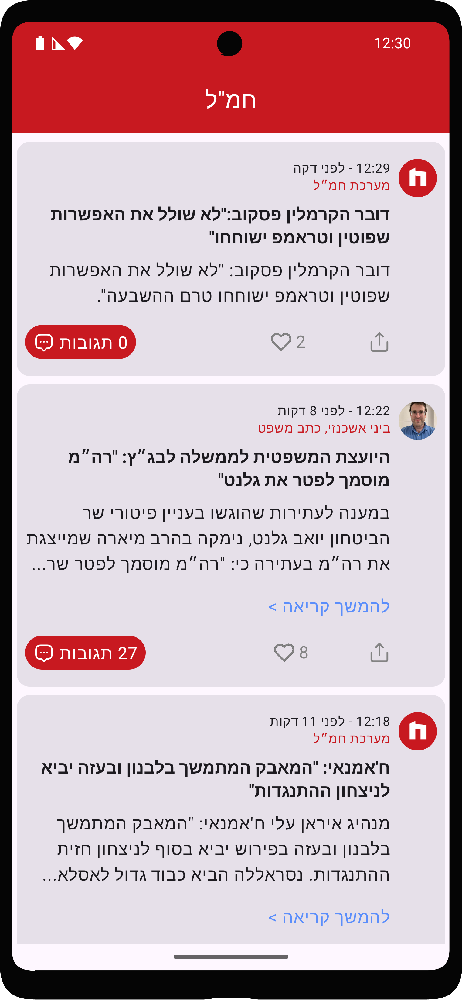
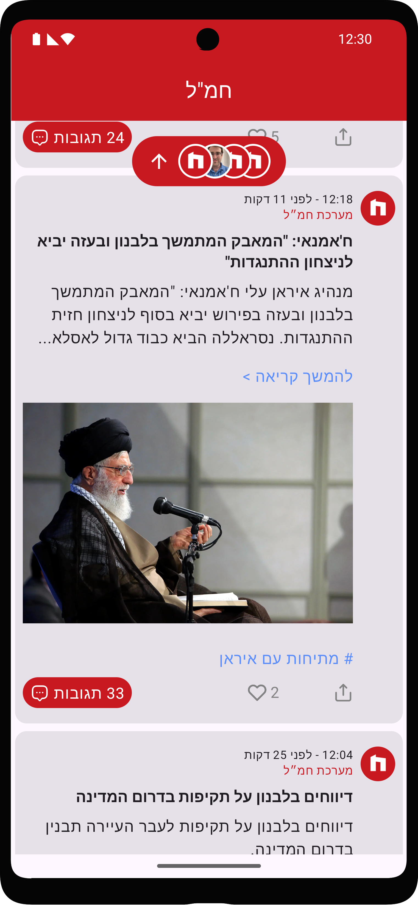
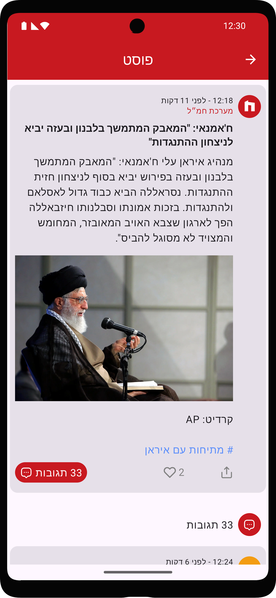
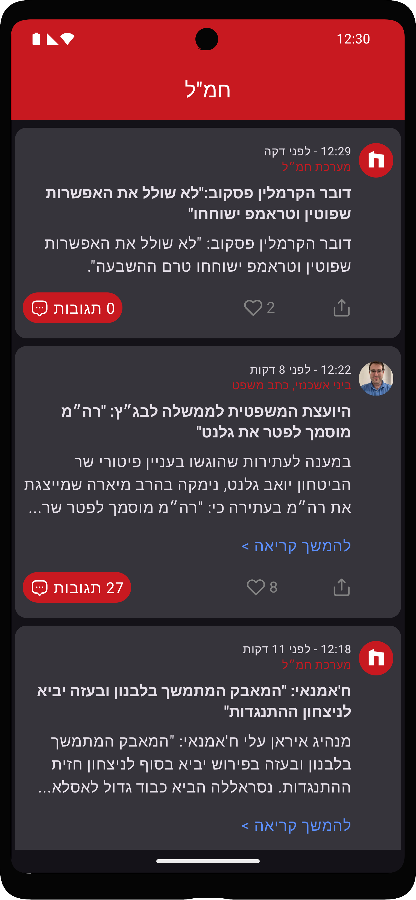
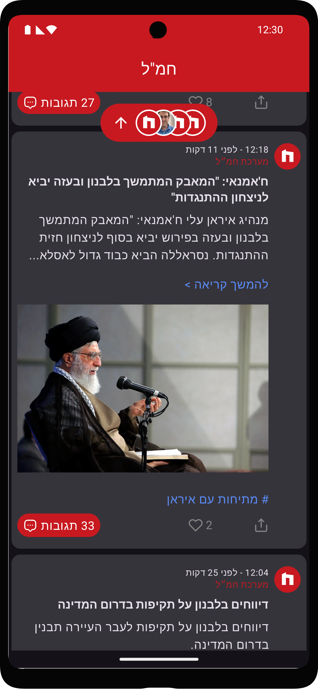
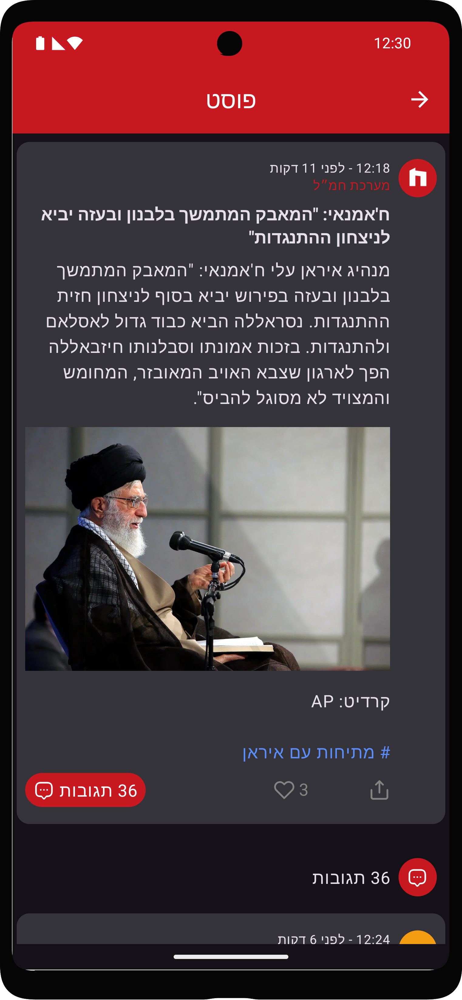

# Hamal (חמ"ל) - Unofficial Client

My version of the Hamal news app client, providing enhanced performance and user experience.

## Features

- Improved performance and user experience
- Custom enhancements to the original חמ"ל news app functionality
- Uses the same REST API as the official חמ"ל app

## Disclaimer

This project is an **unofficial client** for the חמ"ל news app. It is not affiliated with or endorsed by the official חמ"ל developers. The app name and any associated trademarks belong to their respective owners.

## Screenshots
### Light
|  |  |  |
|-------------------------------|-----------------------------------------------|-------------------------------|

### Dark
|  |  |  |
|-----------------------------------------|---------------------------------------------------------|-----------------------------------------|
